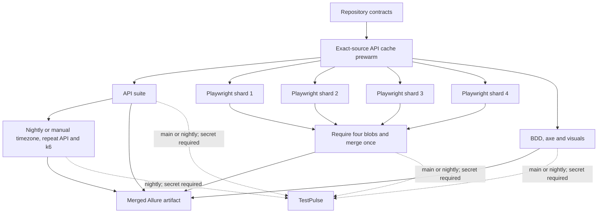

# Cal.diy QA Strategy & Automation

A risk-led QA engagement against the self-hostable Cal.diy scheduling platform.
The project begins with the test environment and strategy; automation is added
only after the risks and test boundaries are explicit.

## Target provenance

The system under test is the public [`calcom/cal.diy`](https://github.com/calcom/cal.diy)
repository at tag [`v6.2.0`](https://github.com/calcom/cal.diy/releases/tag/v6.2.0),
commit `1c193cca8682b33b9866c792186033f7ef886682`. That tag was published while the
repository still carried the Cal.com name. In April 2026, Cal.com moved its
production codebase to a private repository and renamed the public repository
Cal.diy. This engagement therefore does **not** claim access to, or coverage of,
the current hosted Cal.com production code. The vendor's transition is described
in its [announcement](https://cal.com/blog/cal-com-goes-closed-source-why).

## Delivery status

| Phase | Deliverable | Status |
|---|---|---|
| 1 | Pinned local environment, test strategy, risk analysis | Implemented |
| 2 | API v2 automation with pytest and httpx | Implemented |
| 3 | Playwright E2E, selective Cucumber BDD, accessibility and visual checks | Implemented |
| 4 | k6 performance and contention gates | Implemented |
| 5 | CI, Allure reporting and TestPulse ingestion | Implemented; four suites ingested |
| 6 | Verified defect reports and eligible upstream reports | Planned |

The Phase 2 local run passed 13 of 13 API tests in 17.58 seconds with 77%
branch-aware package coverage. It produced 14 evidence-backed contract
compatibility findings against the historical `v6.2.0` snapshot.

Phase 3 produced these local results: 12 of 12 browser lifecycle tests passed,
all three BDD scenarios and 18 steps passed, 13 of 13 timezone tests passed,
and both visual comparisons passed. The accessibility gate intentionally
remains red: one of three surfaces passed and two failed with three documented
serious or critical findings. The timezone suite produced one additional local
snapshot finding. These are local results, not current-upstream or hosted
Cal.com claims; none has been filed upstream.

Phase 4 established a five-run local availability baseline and a 2,300 ms p95
gate. The commit-bound acceptance run passed at 1,408.838 ms p95 with zero
application errors across 924 measured calls. The throughput run completed 50
of 50 unique bookings with zero application or cleanup errors. Twenty-way
contention produced exactly one success, 19 expected conflicts, and one
persisted booking, with zero unexpected, persistence, or cleanup errors. These
are local amd64 Docker results, not production SLOs or public-infrastructure
load results.

Phase 5 push-tier run
[`30778631910`](https://github.com/Mohanad49/caldiy-qa-strategy/actions/runs/30778631910)
passed repository validation, API smoke/contracts and 13 of 13 API tests, all
four Playwright shards and the required merge with 15 of 15 E2E tests, all
three BDD scenarios, and merged Allure generation. The browser-quality job is
honestly red: one of three accessibility surfaces passed, and both hosted-Linux
visual comparisons differ from the committed macOS baselines. No CI badge is
shown. `TESTPULSE_DATABASE_URL` is absent, so ingestion was visibly skipped and
no TestPulse history is claimed from that earlier run.

Manual-tier run
[`30777108027`](https://github.com/Mohanad49/caldiy-qa-strategy/actions/runs/30777108027)
proved that the 13-test timezone matrix, repeated 13-test API run, and k6 jobs
start only after the core API job passes. Hosted-runner availability measured
320.39 ms p95 with 0/1,090 application errors, unique booking completed 50/50,
and contention produced one success, 19 expected conflicts, and one persisted
booking. Its browser-quality branch hit fresh-route 404s, so those browser
results are not accepted; the bounded readiness fix is verified by the push run
above. The workflow remains red and unbadged for the evidence-backed axe and
visual findings.

Manual verification run
[`30932432000`](https://github.com/Mohanad49/caldiy-qa-strategy/actions/runs/30932432000)
confirmed `TESTPULSE_DATABASE_URL` by presence only and completed successful
ingestion steps for the core and repeated API reports, the once-merged E2E
report, BDD, and the merged performance gates. These map to the four stable
suites `caldiy-api-v2`, `caldiy-e2e`, `caldiy-bdd`, and
`caldiy-performance-gates`. The run's overall conclusion is still failure
because the unsuppressed axe and visual gates remain red; reporting did not
override product confidence.

[TestPulse](https://github.com/Mohanad49/testpulse) is already a separate,
publicly available project. This private repository now ingests the four suites
above on eligible `main` and manual/nightly runs. The database URL was neither
printed nor copied during verification.

## CI architecture



## Stable commands

Phase 1 environment commands:

```text
make sut-bootstrap
make sut-smoke
make sut-down
make sut-reset CONFIRM=caldiy-qa-strategy
make validate
```

Phase 2 API runtime and automation commands:

```text
make api-build
make sut-api-bootstrap
make sut-api-smoke
make test-bootstrap
make test-api
make contracts-verify
```

Phase 3 browser, timezone and accessibility commands:

```text
make test-e2e
make test-timezones
make test-bdd
make test-a11y
make update-snapshots CONFIRM=caldiy-qa-strategy
```

Phase 4 local performance commands:

```text
make perf-baseline
make test-perf
make test-contention
```

The API v2 image is built locally from the exact controlled commit and is not
redistributable. It must not be pushed to a container registry.

## Local fixture boundary

Cal.diy's official development seed provides accounts such as
`pro@example.com` / `pro`. These are public, local-only fixture credentials.
They must never be reused for a deployed environment or treated as secrets.

## Documentation

- `docs/TEST-STRATEGY.md` — engagement scope, risk priorities and quality gates
- `docs/RISK-ANALYSIS.md` — timezone and DST failure model
- `docs/API-V2-RUNTIME.md` — exact-source build and runtime qualification evidence
- `docs/API-AUTOMATION.md` — client design, contract policy, coverage and local results
- `docs/PHASE-3-EVIDENCE.md` — measured browser, timezone, accessibility and visual results
- `docs/PHASE-4-EVIDENCE.md` — measured local performance and contention results
- `docs/PHASE-5-CI.md` — tiered CI boundaries, reporting, retention and run evidence
- `docs/findings/` — snapshot-specific compatibility findings requiring current-upstream verification
- `DECISIONS.md` — decisions written or approved by Mohanad after each phase
