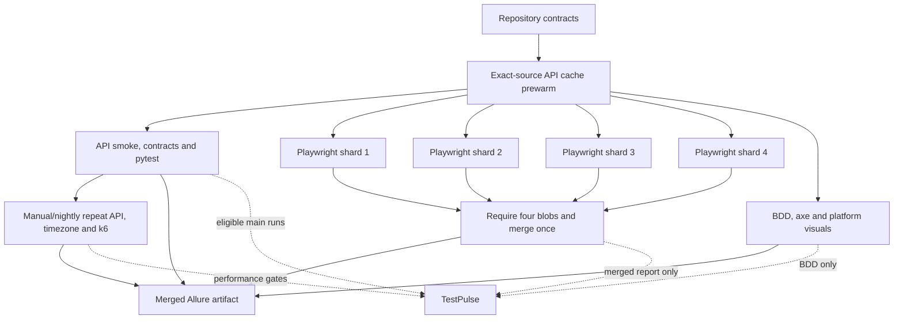

# Cal.diy QA Strategy & Automation

A six-phase, risk-led QA engagement against a real scheduling platform:
reproducible infrastructure, API contracts, browser lifecycle coverage,
timezone/DST analysis, accessibility and visual gates, performance/contention,
tiered CI, longitudinal reporting and evidence-backed defect reports.

## Target and claim boundary

The controlled system under test is [`calcom/cal.diy`](https://github.com/calcom/cal.diy)
tag [`v6.2.0`](https://github.com/calcom/cal.diy/releases/tag/v6.2.0), commit
`1c193cca8682b33b9866c792186033f7ef886682`. This was the final public Cal.com
release before the production codebase became private and the public repository
was renamed Cal.diy in April 2026. The vendor's
[transition announcement](https://cal.com/blog/cal-com-goes-closed-source-why)
explains that history.

Nothing here claims access to current Cal.com production code, coverage of
hosted Cal.com, or current public Cal.diy `main` runtime behavior. Public `main`
is consulted only for defect triage and a non-blocking contract advisory.

## Why this engagement

Scheduling failures cluster at boundaries that happy-path UI tests miss: one
instant rendered as different local dates, capacity-one contention, lifecycle
state split across API/UI/email, and public booking controls that exclude users.
The strategy therefore ranks timezone/DST correctness and booking integrity
ahead of broad feature count, then implements each risk at the lowest useful
layer.

## Delivery status

| Phase | Delivered result | Status |
|---|---|---|
| 1 | Digest-pinned local stack, idempotent official seed, strategy and DST risk model | Implemented |
| 2 | Qualified private API v2 runtime, typed pytest/httpx automation and contract validation | Implemented |
| 3 | Playwright lifecycle, exactly three Cucumber journeys, 14-test timezone suite, axe and visuals | Implemented |
| 4 | Five-run k6 baseline, availability/throughput gates and capacity-one contention proof | Implemented |
| 5 | Tiered CI, four-shard merge, Allure artifacts and four stable TestPulse suites | Implemented |
| 6 | Current-main triage, two professional defect reports and two public upstream issues | Implemented |

Public Allure Pages deployment is prepared but intentionally disabled while the
repository is private. It becomes an owner-controlled release step after the
visibility change; see [the public-release checklist](docs/PUBLIC-RELEASE.md).

## Final audit evidence

The full local release audit ran on 2026-08-05 from a project-scoped reset and
official reseed. A second bootstrap preserved data and skipped reseeding. The
complete API stack then remained healthy for ten minutes with no restarts and a
1,560 MiB peak under its 7,168 MiB ceiling.

| Layer | Final observed result |
|---|---|
| API runtime/contracts | PostgreSQL, web, Mailpit, Redis, `/health`, `/docs-json` and seeded `/v2/me` passed; all 18 used runtime operations matched the pinned OpenAPI snapshot |
| API suite | 13/13 passed in 17.924 s with four workers |
| Browser lifecycle | 12/12 passed across authoritative Chromium coverage and focused Firefox smoke |
| BDD | 3/3 scenarios and 18/18 steps passed; validation no longer overwrites its real JUnit evidence |
| Timezone/DST | 14/14 passed across nine zones, including a host/booker date rollover through reschedule and email |
| Visual | 2/2 Darwin and 2/2 ordinary `ubuntu-24.04` comparisons passed; platform baselines remain separate and mask guards preserve meaningful content |
| Accessibility | 1/3 surfaces passed; 2/3 remain red for unsuppressed serious/critical findings |
| Availability/load | 0/871 application errors; p95 1,212.828 ms under the calibrated 2,300 ms local-Docker gate |
| Booking throughput | 50/50 unique bookings; zero application or cleanup errors |
| Contention | Exactly 1 success, 19 expected conflicts and 1 persisted booking; zero integrity or cleanup errors |

The red accessibility result is intentional and visible. It is evidence about
the historical snapshot, not a flaky-test waiver and not a reason to present the
workflow as green. No CI badge is shown while the complete quality workflow has
an enforced product failure.

Manual/nightly-equivalent release run
[`30966169388`](https://github.com/Mohanad49/caldiy-qa-strategy/actions/runs/30966169388)
repeated the complete hosted tier on exact test commit
`97eee19bcca18b1c6fc58efa72428ce19a6ec6d8` and explicit `ubuntu-24.04`.
Both API runs passed 13/13, merged E2E passed 15/15, BDD passed 3/3,
timezone/DST passed 14/14, both visuals passed, and the merged Allure artifact
was generated. Hosted availability recorded 0/1,043 application errors and
427.503 ms p95 under the 2,300 ms local-Docker gate; booking completed 50/50
with zero application or cleanup errors; contention again produced exactly one
success, 19 conflicts and one persisted booking. TestPulse stored the five
eligible inputs as runs 183–187. The workflow's sole failing job was the
browser-quality job, at its final enforcement of the unchanged 1/3-pass axe
report.

## Architecture



The API v2 image is rebuilt from the exact controlled source. Its upstream
package is marked `UNLICENSED`, so the image is labelled non-redistributable and
is never pushed to a registry or uploaded as a workflow artifact; CI shares
Buildx cache layers only.

## Quick start

Local live execution requires an Intel/amd64 Docker engine with roughly 8 GB
allocated, plus the pinned Python, Node and pnpm toolchains declared in the
repository. The upstream web image is not a normal arm64 runtime. The first API
build is multi-gigabyte and can take materially longer than later cached runs.

```text
make sut-bootstrap       # web, PostgreSQL and Mailpit; generates ignored local secrets
make sut-smoke
make sut-api-bootstrap   # builds/starts API v2 and performs the 10-minute qualification
make test-bootstrap      # installs locked Python/Node/browser dependencies
make validate
```

Cal.diy's official development seed provides local fixtures including
`pro@example.com` / `pro`. They are public test credentials, never production
credentials. Only `.env.example` is tracked; generated secrets remain in the
ignored `.env` file.

## Stable commands

```text
# Environment
make sut-bootstrap
make sut-smoke
make sut-down
make sut-reset CONFIRM=caldiy-qa-strategy

# API and contracts
make api-build
make sut-api-bootstrap
make sut-api-smoke
make test-bootstrap
make test-api
make contracts-verify

# Browser quality
make test-e2e
make test-timezones
make test-bdd
make test-a11y
make test-visual
make update-snapshots CONFIRM=caldiy-qa-strategy

# Performance and current-main advisory
make perf-baseline
make test-perf
make test-contention
make defects-audit

# Repository contracts
make validate
```

Tests create run/worker-specific data and clean active resources through
supported interfaces in LIFO order. API v2 exposes booking cancellation rather
than deletion, so a confirmed project-scoped reset is the clean checkpoint that
removes retained historical rows.

## Reporting and defects

CI retains traces, screenshots and video on failure for 14 days and merged
JUnit, k6, contract and Allure evidence for 30 days. Eligible `main` and
manual/nightly runs feed four suite identities into TestPulse. Its
[public dashboard](https://testpulse-eight.vercel.app) is a separately generated
static export; run summaries from a private source repository are not added to
that export without a deliberate decision to publish them. I took that decision
on 2026-08-09. TestPulse publication run
[`31284812109`](https://github.com/Mohanad49/testpulse/actions/runs/31284812109)
then deployed all four Cal.diy suite summaries; the published API, BDD, and E2E
runs include verified Cal.diy commit `1907d5997f1b252f0230d1e0ecb392c6cbdc65db`.
This reporting approval did not itself change repository visibility or enable
Allure Pages.

- `caldiy-api-v2`
- `caldiy-e2e`
- `caldiy-bdd`
- `caldiy-performance-gates`

The TestPulse secret is checked by presence only. Ingestion is non-blocking for
product confidence but emits an error annotation and workflow summary when it
records nothing. Pull-request reports never enter longitudinal history.

Phase 6 reproduced two Medium contract defects against exact current public
Cal.diy source and searched issues and pull requests before filing:

- [calcom/cal.diy#29903](https://github.com/calcom/cal.diy/issues/29903) — duplicate calendar operation IDs.
- [calcom/cal.diy#29904](https://github.com/calcom/cal.diy/issues/29904) — default booking-field booleans documented as objects.

Fourteen other historical runtime/UI findings remain local because the required
current runtime or UI evidence was not reproduced. The project does not turn a
suspicious schema or historical observation into a current defect claim.

## Scope and durable maintenance

Out of scope: hosted Cal.com, API v1, payments, real OAuth/calendar providers,
enterprise-only functionality, native mobile, license enforcement and
destructive security testing. Local latency is not a production SLO. The known
initial guest-email limitation and historical DST state limitations are
documented rather than bypassed through SQL.

Pins reduce drift but cannot guarantee that registries, hosted runners or future
timezone rules never change. [Maintenance and recovery rules](docs/MAINTENANCE.md)
define monthly pin review, evidence-preserving triage and a quarterly clean-room
rebuild. The repository currently grants no reuse license; public visibility
permits inspection, not open-source redistribution.

## Documentation map

- [Project brief traceability](docs/BRIEF-TRACEABILITY.md)
- [Test strategy](docs/TEST-STRATEGY.md)
- [Timezone and DST risk analysis](docs/RISK-ANALYSIS.md)
- [API v2 runtime qualification](docs/API-V2-RUNTIME.md)
- [API automation and contract policy](docs/API-AUTOMATION.md)
- [Phase 3 browser/timezone/accessibility evidence](docs/PHASE-3-EVIDENCE.md)
- [Phase 4 performance and contention evidence](docs/PHASE-4-EVIDENCE.md)
- [Phase 5 CI and reporting evidence](docs/PHASE-5-CI.md)
- [Defect register and current-main disposition](docs/defects/README.md)
- [Decision log](DECISIONS.md)
- [Public-release checklist](docs/PUBLIC-RELEASE.md)
